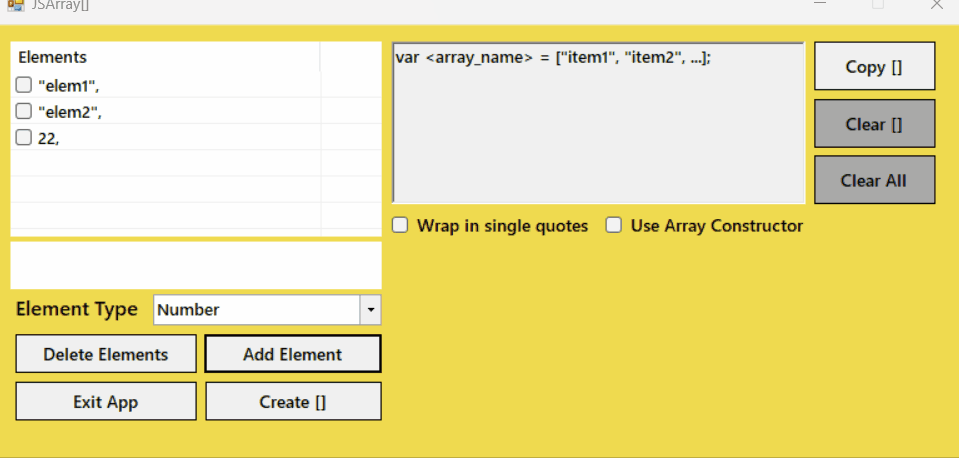

# JSArray v1.0.0

> A JavaScript array generator tool used to aid in writing lengthy arrays.

---

## [Table Of Contents](#contents)

- [About](#about)
- [Install](#install)
- [Usage](#usage)
- [Contributing](#contributing)
- [Security](#security)
- [Contacts](#contacts)

## [About](#about)

JSArray is for times when you need to create really long arrays and don't want to take 5 years writing it because of all the commas and quotes.
It allows you to simply enter the array elements and customize the resulting array element style. When you are done you just copy the output.

---

## [Install](#install)

Install section is in Progress...

---

## [Usage](#usage)

JSArray is really simple to use. It doesn't have the prettiest gui ever, but works in it's 
intended way really well.

### Step 1) 
	
Pick an array element type with the dropo down selector labeled ***"Element Type"***.

###  step 2) 

Next after picking an element type, enter your first element in the
text box above the ***"Element Type"*** selector and press `Enter` on the 
keyboard or the ***"Add Element"*** button in JSArray.

### step 3) 
	
Once you have entered all of the elements that you want press the ***"Create []"*** 
button to generate the array with all of your elements in the output box.

### step 4) 

After pressing **"Create []"** you can choose to wrap any quoted elements in 
either single quotes `''` or double quotes `""`.

### step 5) 
	 
Once you decide on single or double quotes you can also choose to use either 
an array constructor or an array literal.

### step 6)

After you finish building your array change "\<array name\>" to the name you want.

### step 7)

Finally press the ***"Copy []"*** button to copy the array to the clipboard.

### step 8)

When your done and if you need to make another array you can press the ***"Clear []"***
button to clear the array output. If you have unused elements in the Elements 
list or text in the element input text box press the ***"Clear All"*** button instead.

---

## [Contributing](#contributing)

If you have any feature requests, suggestions or general questions you can reach me via any of the 
methods listed below in the [Contacts](#contacts) section.

---

## [Security](#security)

### Reporting a vulnerability or bug?

**Do not submit an issue or pull request**: A general rule of thumb is to never publicly report 
bugs or vulnerabilities because you might inadvertently reveal it to unethical people who may 
use it for bad. Instead, you can email me directly at: 
[paulmccarthy676@gmail.com](mailto:paulmccarthy676@gmail.com). 
I will deal with the issue privately and submit a patch as soon as possible.

---

## [Contacts](#contacts)

**Author:** Paul M.

* Email: [paulmccarthy676@gmail.com](mailto:paulmccarthy676@gmail.com)
* Github: [https://github.com/happycod3r](https://github.com/happycod3r)
* Linkedin: [https://www.linkedin.com/in/paul-mccarthy-89165a269/]( https://www.linkedin.com/in/paul-mccarthy-89165a269/)
* Facebook: [https://www.facebook.com/paulebeatz]( https://www.facebook.com/paulebeatz)

---

